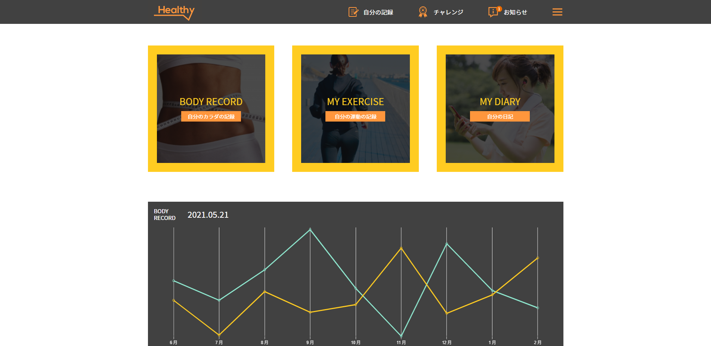

## Project Name:

- HealthApp_1203: Build Health App using ReactJS version 17.0.2, typescript version 4.4.4. Also, includes Tailwindcss

  Page 1:
  
  Page 2:
  
  Page 3:
  

# Getting Started with Create React App

This project was bootstrapped with [Create React App](https://github.com/facebook/create-react-app).

## How to run && build:

In the project directory, you can run:\
cd src/:

```bash

  - yarn install
  - yarn start: Open [http://localhost:3000](http://localhost:3000) to view it in your browser.
  - yarn test: Launches the test runner in the interactive watch mode.
  - yarn build: Builds the app for production to the `build` folder.
```

## How to edit/show data:

- Go to src/constant/index.ts

## How to change the Chart:

- Refresh the page every time then the data will be changed.

### Install Tailwindcss:

- Link: https://tailwindcss.com/docs/installation

  - npm install -D tailwindcss
  - npx tailwindcss init
